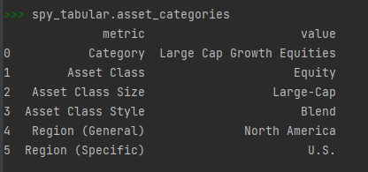
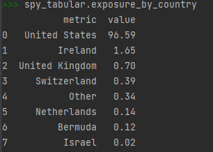

# ETFpy
[](https://codecov.io/gh/JakubPluta/pyetf)
[](https://badge.fury.io/py/etfpy)
<a target="new" href="https://github.com/JakubPluta/pyetf"></a>

**ETFpy** is a Python library that allows users to scrape data from etfdb.com, 
a website that provides comprehensive information on ETFs, 
including trading data, performance metrics, assets allocations end more. 

## Installation

### Install with pip as a package [pip](https://pypi.org/project/etfpy)
```
pip install etfpy
```
or

### Clone repostiory
```bash
# clone repository
git clone https://github.com/JakubPluta/pyetf.git
```
```bash
# navigate to cloned project and create virtual environment
python -m venv env
```
```bash
# activate virtual environment
source env/Scripts/activate # or source env/bin/activate
```

```python
# install poetry
pip install poetry
```

```python
# install packages
poetry install
```

## Usage

```python
>>> from etfpy import ETF, load_etf, get_available_etfs_list

# returns list of available ETFs.
>>> etfs = get_available_etfs_list()
>>> etfs
>>> ['SPY', 'IVV', 'VOO', 'VTI', 'QQQ', 'VEA', 'VTV', 'IEFA', 'BND', 'AGG', 'VUG', 'IJH', ... ]

# load etf
>>> vwo = load_etf('VWO')
# or
>>> spy = ETF("SPY")

# get basic ETF information
>>> spy.info
>>> {
    '52 Week Hi': '$457.83',
    '52 Week Lo': '$342.72',
    'AUM': '$402,034.0 M',
    'Asset Class': 'Equity',
    'Asset Class Size': 'Large-Cap',
    'Asset Class Style': 'Blend',
    'Brand': 'https://etfdb.com/issuer/spdr/',
    'Category': 'Size and Style',
    'Category:': 'Large Cap Growth Equities',
    'Change:': '$1.04 (-0.0%)',
    'ETF Home Page': 'https://www.spdrs.com/product/fund.seam?ticker=SPY',
    'Expense Ratio': '0.09%',
    'Focus': 'Large Cap',
    'Inception': 'Jan 22, 1993',
    'Index Tracked': 'https://etfdb.com/index/sp-500-index/',
    'Issuer': 'https://etfdb.com/issuer/state-street/',
    'Last Updated:': 'Sep 30, 2023',
    'Niche': 'Broad-based',
    'P/E Ratio': {'ETF Database Category Average': '15.15',
               'FactSet Segment Average': '5.84',
               'SPY': '17.86'},
    'Price:': '$427.48',
    'Region (General)': 'North America',
    'Region (Specific)': 'U.S.',
    'Segment': 'Equity: U.S.  -  Large Cap',
    'Shares': '938.3 M',
    'Strategy': 'Vanilla',
    'Structure': 'UIT',
    'Symbol': 'SPY',
    'Url': 'https://etfdb.com/etf/SPY',
    'Weighting Scheme': 'Market Cap'
}

# technical analysis metrics
>>> spy.technicals
>>> {
     '20 Day MA': '$50.45',
     '60 Day MA': '$50.74',
     'Average Spread ($)': '1.00',
     'Average Spread (%)': '1.00',
     'Lower Bollinger (10 Day)': '$48.64',
     'Lower Bollinger (20 Day)': '$48.33',
     'Lower Bollinger (30 Day)': '$48.81',
     'MACD 100 Period': '-0.74',
     'MACD 15 Period': '0.20',
     'Maximum Premium Discount (%)': '0.82',
     'Median Premium Discount (%)': '0.27',
     'RSI 10 Day': '49',
     'RSI 20 Day': '47',
     'RSI 30 Day': '47',
     'Resistance Level 1': 'n/a',
     'Resistance Level 2': '$50.53',
     'Stochastic Oscillator %D (1 Day)': '53.54',
     'Stochastic Oscillator %D (5 Day)': '73.08',
     'Stochastic Oscillator %K (1 Day)': '55.09',
     'Stochastic Oscillator %K (5 Day)': '57.68',
     'Support Level 1': 'n/a',
     'Support Level 2': '$49.86',
     'Tracking Difference Max Downside (%)': '-0.87',
     'Tracking Difference Max Upside (%)': '0.16',
     'Tracking Difference Median (%)': '-0.36',
     'Ultimate Oscillator': '47',
     'Upper Bollinger (10 Day)': '$50.47',
     'Upper Bollinger (20 Day)': '$52.61',
     'Upper Bollinger (30 Day)': '$52.50',
     'Williams % Range 10 Day': '19.32',
     'Williams % Range 20 Day': '59.31'
    }

# dividends metrics
>>> spy.dividends
>>> {
    'Annual Dividend Rate': {'ETF Database Category Average': '$ 0.95',
                      'FactSet Segment Average': '$ 0.63',
                      'SPY': '$ 6.51'},
    'Annual Dividend Yield': {'ETF Database Category Average': '1.37%',
                       'FactSet Segment Average': '1.41%',
                       'SPY': '1.52%'},
    'Dividend': {'ETF Database Category Average': '$ 0.33',
                        'FactSet Segment Average': '$ 0.16',
                        'SPY': '$ 1.58'},
    'Dividend Date': {'ETF Database Category Average': 'N/A',
                       'FactSet Segment Average': 'N/A',
                       'SPY': '2023-09-15'}
        }


# performance metrics
>>> spy.performance
>>> {
    '1 Month Return': {'ETF Database Category Average': '-2.89%',
                'Factset Segment Average': '-2.07%',
                'SPY': '-3.11%'},
    '1 Year Return': {'ETF Database Category Average': '19.00%',
               'Factset Segment Average': '10.82%',
               'SPY': '19.69%'},
    '3 Month Return': {'ETF Database Category Average': '-2.10%',
                'Factset Segment Average': '-1.07%',
                'SPY': '-1.70%'},
    '3 Year Return': {'ETF Database Category Average': '5.55%',
               'Factset Segment Average': '4.06%',
               'SPY': '10.18%'},
    '5 Year Return': {'ETF Database Category Average': '5.33%',
               'Factset Segment Average': '2.06%',
               'SPY': '9.83%'},
    'YTD Return': {'ETF Database Category Average': '14.37%',
            'Factset Segment Average': '6.70%',
            'SPY': '13.02%'}
}

# volatility metrics
>>> spy.volatility
>>>  {
     '20 Day Volatility': '10.61%',
     '200 Day Volatility': '10.91%',
     '5 Day Volatility': '200.37%',
     '50 Day Volatility': '11.16%',
     'Beta': '1.0',
     'Standard Deviation': '26.89%'
}
```
You can also wrap ETF object with pandas DataFrames, and work with the data in tabular form.
You will have access to mostly the same methods as etf has, but as a result you will see DataFrame or Series.

```python
>>> from etfpy import ETF
>>> spy = ETF("SPY")
>>> spy_tabular = spy.to_tabular()
```





If you want to scrape list of all etfs with some basic information in terminal use:
```bash
python etfpy/scripts/scrape_etfs.py
or 
bash jobs/run_scrape_etfs.sh
or
make scrape
```
Output data will be stored in `.\etfpy\data\etfs\etfs_list.json`

Run tests & check coverage 
```bash
# run all tests
make test

# pytest cov
make cov
```

To lint
```bash
make pretty
```


## Contributing
Pull requests are welcome.

## License
[MIT](https://choosealicense.com/licenses/mit/)
